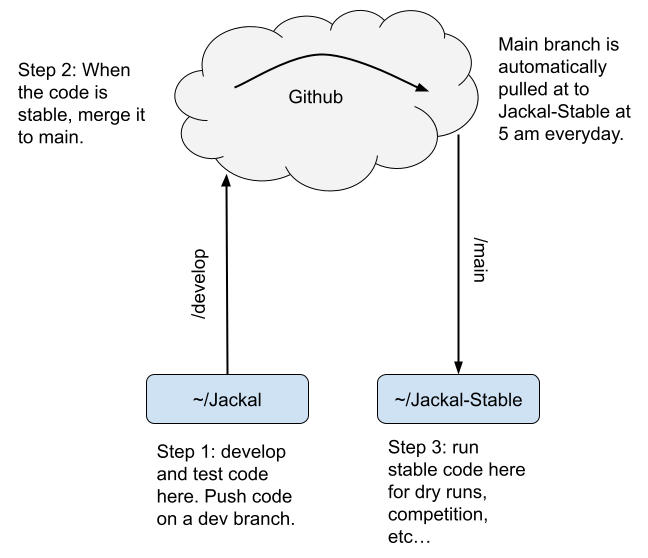

# DTC PRONTO 😷

This contains all the necessary code and configs for the Darpa Triage Challenge PRONTO Team.

## Development Guide

If you are developing for the Falcon UAV or basestation, please make sure you push your code to the correct github repo. It is best practice to push your code on a branch and then merge the branch with the main branch when your code is working consistently, this way we can ensure that if we pull code from the main branch it will work as intended.



Since the Jackals have a lot of software and platforms we want to keep consistent, we've set up an automated system on the jackals as shown in the image above. You should develop your code in the `~/Jackal` folder and test it here as well. You should push unstable code to dev branch (or any branch that isn't main). Once the code is stable, you can merge it to main. Every day at 5am the `Jackal-Stable` repo will pull the changes on the main branch into them. When the robots turn on they will automatically update the `Jackal-Stable` repo from github. The `Jackal-Stable` repo should work reliably, but if you push bad code to main on any of the `jackal-*` repos it will show up here and break things. These rules apply to all other mobile platforms (Spots, Falcon, Skydios)

## Repository Overview
<table cellpadding="2" cellspacing="0">
  <tr>
    <!-- Swapped h2 for font size="5" to destroy the GitHub underline -->
    <td colspan="6" align="center"><b><font size="5">Repositories</font></b></td>
  </tr>

  <tr>
    <td colspan="2" align="center"><b>Basestation / Medic ATAK</b></td>
    <td colspan="2" align="center"><b>UAVs</b></td>
    <td colspan="2" align="center"><b>UGVs</b></td>
  </tr>

  <tr>
    <td align="center" bgcolor="#f8d4ad"><a href="https://github.com"><b>basestation</b></a></td>
    <td align="center" bgcolor="#d9d4f7"><a href="https://github.com"><b>atak</b></a></td>
    <td align="center" bgcolor="#f4b8bd"><a href="https://github.com"><b>Falcon-Stable</b></a></td>
    <td align="center" bgcolor="#b9d2f2"><a href="https://github.com"><b>Skydio-Stable</b></a></td>
    <td align="center" bgcolor="#aee6c2"><a href="https://github.com"><b>Jackal-Stable</b></a></td>
    <td align="center" bgcolor="#fff1ad"><a href="https://github.com"><b>Spot-Stable</b></a></td>
  </tr>

  <tr>
    <td align="center" bgcolor="#f8d4ad"><a href="https://github.com">common</a></td>
    <td align="center" bgcolor="#d9d4f7"><a href="https://github.com-plugin">atak-plugin</a></td>
    <td align="center" bgcolor="#f4b8bd"><a href="https://github.com">falcon-triage</a></td>
    <td align="center" bgcolor="#b9d2f2"><a href="https://github.com">skydio-localization</a></td>
    <td colspan="2" align="center" bgcolor="#bdbdbd"><a href="https://github.com">platform-triage</a></td>
  </tr>

  <tr>
    <td align="center" bgcolor="#f8d4ad"><a href="https://github.com">scoring-server-submission</a></td>
    <td align="center" bgcolor="#d9d4f7"><a href="https://github.com">rostak</a></td>
    <td align="center" bgcolor="#f4b8bd"><a href="https://github.com">falcon-autonomy</a></td>
    <td align="center" bgcolor="#b9d2f2"><a href="https://github.com">skydio_detection</a></td>
    <td align="center" bgcolor="#aee6c2"><a href="https://github.com">jackal-autonomy</a></td>
    <td align="center" bgcolor="#fff1ad"><a href="https://github.com">spot-autonomy</a></td>
  </tr>

  <tr>
    <td colspan="2"></td>
    <td align="center" bgcolor="#f4b8bd"><a href="https://github.com">falcon-base</a></td>
    <td align="center" bgcolor="#b9d2f2"><a href="https://github.com">skydio_decode</a></td>
    <td colspan="2" align="center" bgcolor="#bdbdbd"><a href="https://github.com">platform-base</a></td>
  </tr>

  <tr>
    <td colspan="2"></td>
    <td colspan="2" align="center" bgcolor="#bdbdbd"><a href="https://github.com">uav_tracker</a></td>
    <td align="center" bgcolor="#aee6c2"><a href="https://github.com">jackal-service</a></td>
    <td align="center" bgcolor="#fff1ad"><a href="https://github.com">spot-service</a></td>
  </tr>

  <tr>
    <!-- Swapped the bottom text to match the clean sizing style -->
    <td colspan="6" align="center"><b><font size="4">Miscellaneous</font></b></td>
  </tr>
  
  <tr>
    <td align="center" bgcolor="#bdbdbd"><a href="https://github.com">deprecated</a></td>
    <td align="center" bgcolor="#bdbdbd"><a href="https://github.com">docker-build-farm</a></td>
    <td align="center" bgcolor="#bdbdbd"><a href="https://github.com">jeti-wifi-interface</a></td>
    <td align="center" bgcolor="#bdbdbd"><a href="https://github.com">triage-experimental</a></td>
    <td colspan="2" align="center" bgcolor="#bdbdbd"><a href="https://github.com">dtc-pronto.github.io</a></td>
  </tr>
</table>

## Pronto Workstation

The Lambda workstation is organized as follows. Everyone has two directories one for code and environments and one for data. You code and envionments should go into `/home/$USER` (a.k.a. `~/`), this is the folder you automatically enter when you shh into the machine or open a terminal. Your data should go in `/mnt/UNENCRYPRTED/$USER`, only you have access to this folder. If you have human subjects data that needs to go onto the encrypted drive at `/mnt/ENCRYPTED`. This drive will not be mounted automatically on boot because it encrypted. To mount it:

```
sudo cryptesetup luksOpen /dev/nvme0p2 nvme
sudo mount /dev/mapper/nvme /mnt/ENCRYPTED
```

If you want to access the encrypted data on docker you need to add your user to the `hsresearcher` group in docker:

```
RUN sudo groupadd hsresearcher
RUN sudo usermod -a -G hsresearcher $USER
```

Then when you run your docker image you need to add this to you docker run command: `--user $(id -u):$(getent group hsresearcher | cut -d: -f3)`.

## UGVs

Below are some usefule tidbits on the UGVs. Feel free to add more descriptions here.

### Logging In

There are three main ways to log into the jackal. If you are indoors, the jackal will automatically connect to the `mrsl_perch` network with the following static ips:

- Phobos: `192.168.129.111`
- Deimos: `192.168.129.112`
- Oberon: `192.168.129.113`
- Titania: `192.168.129.114`

For the spots 

- Aphrodite: `192.168.129.161`
- Ares: `192.168.129.162`

If you go outdoors you can use the `jackalnet2` hotspot, the robots will automatically connect to it only if they are out of range with `mrsl_perch` with the following static ips:

- Phobos: `192.168.50.111`
- Deimos: `192.168.50.112`

Finally, you may connect over the rajant network. The jackals will automatically connect to the rajant no matter what but note that the rajants take a few minutes to boot. To connect via rajant, use a rajant brick and connect to via ethernet. Assign yourself and a static ip address in the network configuration window on linux. Give yourself an ip address of `10.10.10.X` where X is in the range of `0 - 100` (over 100 is reserved for the robots), and a netmask of `255.0.0.0`. I strongly recommoned not using a windows computer for this. On the rajant network the jackals will have the following static ips:

- Phobos: `10.10.10.111`
- Deimos: `10.10.10.112`

Once you have network configurations correct on your ground station you can ssh into the UGV with: `ssh dtc@<UGV_ip>`.

### Running the Jackal

Once you have logged into the jackal, navigate to the `Jackal` directory with `cd Docker`. Here you can configure what components you want to run in the `docker-compose.yml`. In the `jackal-base` image you can configure what sensors you want to run, by setting the environment variable for the respective sensor to `true/false`. Setting the value to true will start the ros device driver, otherwise the driver will not be running and you will not see the rostopics. Additionally, in `docker-compose.yml` you can configure what inference components you want to run in the respective image by setting the `RUN` variable to `true/false`. Once you have your `docker-compose.yml` configured you can start the jackal stack with the following steps.

- `tmux`
- `docker compose up`
  The system is now running and the jackal will be driveable. Follow similar steps to run the Spots.

### Bagging Data

If you want to bag data, follow the start up instruction above. Once your started the jackal with the desired sensors and inference componenets, enter the `jackal-base` image. If you started in `tmux` split your window with `ctrl-b + %` or `ctrl-b + "`, then `cd jackal`. Enter the `jackal-base` image with `./join.bash`. You can also open a new terminal on your groundstation, ssh into the jackal navigate to the jackal directory and run `./join.bash` there. Once in `jackal-base` docker image run `cd data`. This is the persistent data directory and is where all rosbags should be saved. Now you can run `rosbag record <list_of_topics>` to start bagging. If you are bagging camera data bag the `<topic_name>/compressed`, additionally, do not bag event camera data for too long. If you want to bag lidar data, bag the `lidar_packets` and `imu_packets` rather than the point clouds.

Once you have collected your bag file, you can copy it over to your machine. If the file is not too large you can copy it over wifi with:

```
scp /path/to/<date_time>.bag <your_username>@<your_ip_address>:/path/to/<where_you_want_to_save_file>
```

If you files are large it will be faster to use one of the portable SSDs. __Note__: you can only use one of the dtc encrypted drives if you have a linux machine to copy it to. Plug the drive into the robot via usb. Run:

```
lsblk # to see the usb device name, usually sda1 or sdb1
sudo cryptsetup luksOpen /dev/sda1 samsung_t7 # unencrypt
sudo mount /dev/mapper/samsung_t7 /media/dtc # mount
sudo cp /path/to/<bag_file>.bag /media/dtc/ #copies the files
sudo umount /media/dtc # unmount when your done copying data
sudo cryptsetup luksClose samsung_t7
```

Now the portable ssd can be safely unplugged.
